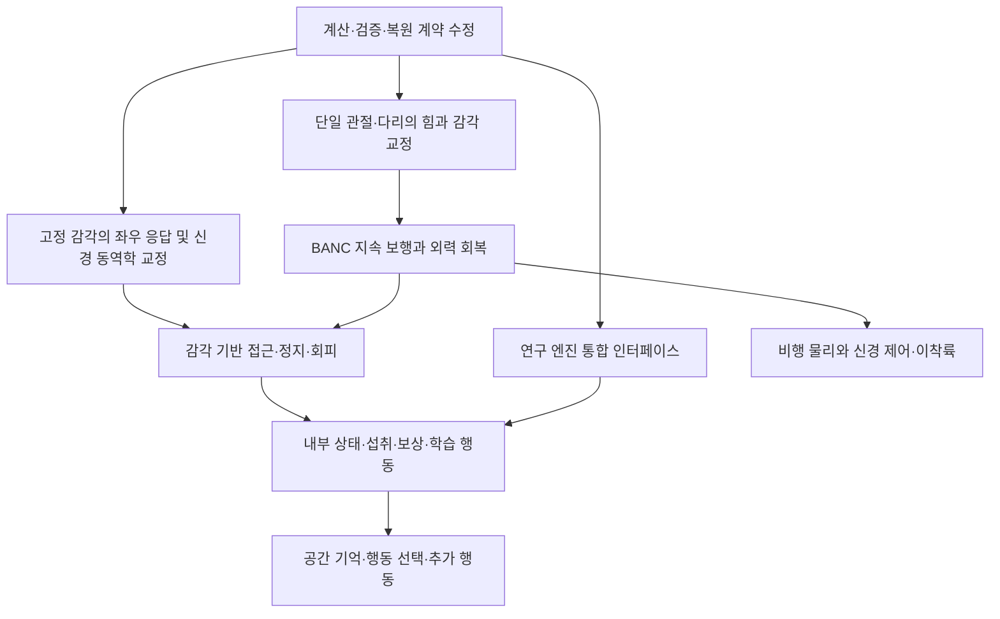

# C 후속 개발 계획 — 독립 리뷰와 현재 코드·원자료의 종합

작성일: 2026-09-10. 기준 커밋: `0cb43cbdd478652f78304115904c2feb874a1f2d` / C 0.6.0.

후속 실행 기록: 사용자 구현 요청에 따라 §12의 첫 범위를 C0.7에 반영했다. R01~R05와 실행 계약, 독립 근육·수용체 최소 계측의 변경·실제 검증은 [C07 개발 결과](/Users/chasoik/Projects/FLY_LAB/docs/C07_IMPLEMENTATION_RESULTS_20260910.md)에 정리했다. 아래의 “이번 작업”은 계획 작성 당시의 진단을 뜻하며, 전체 후속 연구 단계의 완료 선언이 아니다.

**다음 개발은 계산·검증 계약 수정 → 한 관절·한 다리 교정 → 지속 보행 → 자연 감각 행동 → 내부 상태·학습 → 비행·추가 행동 순서로 진행한다.** 현재는 실제 커넥톰을 계산하고 물리적인 몸과 연결하는 실험 플랫폼이다. 안정적인 자율 행동과 학습을 포함한 성체 가상 초파리는 아직 완성되지 않았다.

이 문서는 개발 계획이다. 이번 작업에서는 마지막 ChatGPT 대화 조회, 첨부 증거의 무결성 검사, 현재 코드 대조, 작은 CPU 회로의 결함 재현, 기존 C0.6 원자료 재확인을 수행했다. **앱 소스·모델·프로파일을 수정하거나 새로운 전뇌/MPS/실제 물리 캠페인을 실행하지 않았다.** 문서의 제안 파일·스키마·기준은 구현 완료 항목이 아니다.

## 1. 무엇을 확인했는가

참조 대화 `6a9f7834-0674-83e8-ad6c-528ba2bba9d9`를 `read_thread`로 다시 조회했다. 가장 최근 답변은 C0.6의 네 결함과 미완성 행동을 다룬 리뷰였으며, 첨부된 최신 리뷰·결과 JSON과 대상 커밋이 일치했다. 첨부 문서의 개발 제안은 분석 자료로 사용했다.

| 근거 | 이번 확인 | 해석 범위 |
|---|---|---|
| 현재 체크아웃 | 리뷰와 동일한 `0cb43cbd`, 작업 시작 시 미커밋 변경 없음 | 서로 다른 버전의 비교가 아님 |
| 첨부 증거 ZIP | 152개 항목 중 체크섬 문서 자체를 제외한 **151/151 파일 해시 일치**, 누락·미등재 파일 없음 | 파일 무결성 확인 |
| 첨부 MD·JSON | ZIP 내부 사본과 바이트 일치 | 사용자가 제공한 자료와 재현 자료가 같음 |
| ZIP의 주요 소스 | **12/12 파일이 현재 소스와 바이트 일치** | 네 결함의 대상 코드 일치 |
| 리뷰의 네 반례 | 현재 Python 3.12.7 / Torch 2.14.0 CPU 환경에서 모두 재현 | 합성 회로 검사이며 물리/전뇌 승인이 아님 |
| 추가 반례 | 세 번째 적분 방식의 불일치, 추가 비정상 복원 상태 수락 재현 | 기존 F2·F4의 수정 범위 확대 |
| 기존 C0.6 증빙 | **1,959/1,959 파일, 2,105,248,364바이트 해시 일치**, 소스 체크섬 **205/205 일치** | 저장된 증거의 보존 상태 확인 |
| 기존 캠페인 상세 재확인 | 25조건·282모델초, COMPLETE·physical·technical PASS와 개별 상세 결과 일치 | **행동 전부 PASS라는 뜻이 아님**. 재실행하지 않음 |

이번 감사 기록은 [attachment_audit.json](/Users/chasoik/Projects/FLY_LAB/verification/c07_plan_audit_20260910/attachment_audit.json), [네 반례 결과](/Users/chasoik/Projects/FLY_LAB/verification/c07_plan_audit_20260910/current_probes/results.json), [추가 검사](/Users/chasoik/Projects/FLY_LAB/verification/c07_plan_audit_20260910/supplemental_results.json), [C0.6 해시 감사](/Users/chasoik/Projects/FLY_LAB/verification/c07_plan_audit_20260910/c06_integrity_audit.json), [25조건 상세 대조](/Users/chasoik/Projects/FLY_LAB/verification/c07_plan_audit_20260910/c06_campaign_readback.json)에 보존했다.

독립 리뷰의 회귀 결과는 Torch가 있는 CPU 환경에서 **207 통과·20 건너뜀**, Torch가 없는 네이티브 환경에서 **210 통과·15 건너뜀·2 오류**였다. 두 오류는 연구 테스트의 Torch 의존성 부재다. 기존 작성 환경의 227/227 통과와 모순되는 신경 알고리즘 반례로 해석하지 않는다. 동일 테스트 집합이므로 수를 합산하지 않는다. 이번에는 전체 227개를 다시 실행하지 않았다.

독립 리뷰의 실제 FAFB 검사는 139,255개 뉴런·3,732,460개 뉴런 쌍 연결, 기본 프로파일, CPU, 직접 전진 DN 자극 조건의 **0.15모델초 실행**이다. 연결 유지 순변위 1.191mm, 운동 차단 약 0mm, 0.1초 체크포인트 후 0.05초 연속 계산의 비교 배열 차이 0이었다. 이는 기본 DN→공학적 CPG→몸 경로의 짧은 기여·복원 증거다. BANC 지속 보행, walking-v6 자연 탐색, MPS, 학습·비행의 새 승인 근거로 확장하지 않는다.

## 2. 이전 분석에 추가·수정해야 할 판단

**기존 실패 원인 분석은 유지되지만, 새 실험에 앞서 검증 신뢰성을 수리하는 단계가 추가되어야 한다.** C0.6에서 하중·부착 구분과 거짓 회피 승인을 수정했더라도, 다른 검증 경로와 연구 엔진에 결함이 남아 있었다. 전체 회귀 통과가 모든 지원 설정의 일치를 보장하지 못했다.

| 항목 | 재확인한 현 상태 | 다음 개발의 의미 |
|---|---|---|
| BANC 감각–운동 연결 | 감각 3,604개, 운동 391개, 다리 42자유도 중 41개 구동 | 연결 존재와 지속 보행은 별개 |
| BANC 계산 범위 | 선언된 neuronal roster 158,706개를 계산하는 경로. `fullBrain=false` | 데이터 포함 범위 자체를 완전한 전신 신경계라고 표시할 수 없음 |
| 화학 연결의 실제 전달 | FAFB 3,732,460쌍 중 311,234쌍, BANC 11,584,852쌍 중 1,499,070쌍은 현재 가중치 0 | 해부학적 연결 보존과 기능적 신호 전달을 구분. 미확정/신경조절 전달 모델 보완 필요 |
| BANC 10초 보행 | 기본 0.06895mm, DNg100 자극 0.45970mm | 5mm 보행 기준 실패; 단일 원인은 미확정 |
| 근육 출력 | 발화율→필터→목표 관절각→position actuator | 실제 근육 활성·힘·길이·속도·모멘트암 모델 미구현 |
| 감각 범위 | `rm_coxa_pitch` 미연결, 다리 감각 후보 1,479개의 외부 입력 매핑 미완성, 방향 미확정 8개 | 외부 자극 미연결과 뉴런 계산 제외를 구분 |
| 직접 출력 진단 | 전진·후진·양쪽 조향·정지 후 재개 5/5 통과 | 몸/기존 CPG 경로 진단; BANC 신경 보행의 대체 증거가 아님 |
| 먹이 | 왼쪽 접근 PASS, 오른쪽 FAIL. 왼쪽도 접촉 16.59초와 고착 | 접근 순간의 성공과 지속 탐색을 별도 과제로 평가 |
| BB 정지 | 출력 gate 유지 시 outgoing synapse 차단 후에도 정지. gate 제거 조건 FAIL | 현재 성공은 공학적 출력 억제로 설명됨 |
| 장애물·위험 | 장애물 3대조의 몸 위치 동일; 근접 위험의 여유 개선 약 0.18mm로 기준 미달 | 감각·회로의 회피 기여를 확인하지 못함 |
| 대사 | 가상 섭취·에너지 장부 및 복원 구현 | `neural_modulation=False`; 행동 동기와 미연결 |
| 학습 | 별도 ResearchLIF의 선택 시냅스 reward-STDP와 상태 저장 구현 | 기본 앱/몸에 통합되지 않았고 학습 행동 미검증 |
| 비행 | 독립 FlightRig의 날개 관절·유체력·주기 제어 구현 | 충돌 비활성화, 신경 제어·안정 비행·이착륙 미검증 |

추가 코드 분석에서 **ResearchLIF를 기본 엔진 이름 목록에 넣는 것만으로 학습을 연결할 수 없다는 점**도 확인했다. 기본 `CEngine`은 `advance(drive, steps, capture, pulses)`를 호출하지만 ResearchLIF의 네 번째 인자는 `reward`다. `set_interventions`, `summary`, `region_summary`도 없다. 현재 분리 실행 자체가 오류는 아니지만 통합 개발의 선행 작업이다.

현재 두 bundle의 manifest와 [graph.py](/Users/chasoik/Projects/FLY_LAB/flylab/c/graph.py:101)도 대조했다. 기본 가중치는 접촉 수에 전달물질별 부호와 공통 크기를 곱하며, 미확정 전달물질 및 DA/SER/OCT의 조절 효과는 `mask_zero`, `receptor_model=False`다. FAFB의 비영 가중치 연결은 3,421,226쌍, BANC는 10,085,782쌍이다. 따라서 **포함 뉴런을 모두 계산한다는 말은 모든 연결의 기능을 구현했다는 말이 아니다.** 이 마스킹은 불확실성을 숨기지 않기 위한 현재 정책이며, 전부 흥분성으로 켜는 수정이 해결책은 아니다. 전기 결합도 별도 연구 profile의 명시적 가설 항목으로만 제공된다. 수상돌기/축삭 구획별 형태와 모든 이온 통로를 복원한 모델은 아니다.

리뷰의 “장기 원자료를 확보하지 못했다”는 지적은 외부 배포 경로의 문제로 구체화한다. 현재 로컬에는 기존 원자료가 있고 해시·상세 결과도 일치한다. 외부 검토자가 접근할 수 있는 고정 증거 묶음은 별도로 제공해야 한다. 이번 확인을 새로운 물리 실행으로 기록하지 않는다.

## 3. 개발 완료 상태와 범위

첫 목표는 **선언한 성체 모델에서 자연 감각, 뇌/VNC, 운동 출력, 물리 몸, 내부 상태, 학습이 연결된 검증 가능한 행동**이다. 다음 상태를 각각 표시한다.

| 상태 축 | 필요한 증거 |
|---|---|
| 데이터 | 스냅샷·개체·성별·포함/제외 명부·연결·좌우·세포형의 신원 |
| 계산 | 선택 모델의 파라미터·입력 의미·적분·지연·backend 일치 |
| 물리 연결 | 실제 힘·관절 움직임·감각 되먹임과 차단 대조 |
| 행동 | 고정된 과제와 미사용 조건에서 보행·탐색·정지·회피 등 통과 |
| 생물학 | 관측된 실험/생리 자료와 비교한 범위 및 불확실성 |

성공률을 뉴런 포함 비율이나 구현 파일 수 하나로 환산하지 않는다. FAFB와 BANC는 서로 다른 데이터 경로로 유지한다. 이름이 비슷한 다른 표본의 뉴런을 같은 ID처럼 병합하지 않는다. 발생·성장·번식·노화까지의 전 생애 모델은 후속 범위다.

개발 의존 관계는 다음과 같다. 아래의 가지 분리는 작업 의존성을 뜻하며 새 에이전트나 작업을 생성한 것은 아니다.

고정 몸의 좌우 감각 원인 분석은 BANC 보행 완성을 기다릴 필요가 없다. 다만 최종 BANC 자연 행동 승인은 해당 몸의 보행 통과를 전제로 한다. FAFB+CPG에서 얻은 감각 연구 결과를 BANC 보행 승인으로 옮기지 않는다.

## 4. 1차 작업: 실행·검증 계약 수정

리뷰의 결함 심각도 P2/P3는 유지한다. 여기서 “최우선”은 후속 실험의 신뢰성 때문에 먼저 구현한다는 개발 순서를 의미한다.

| 작업 | 원인과 구현 계획 | 변경 대상 | 완료 조건 |
|---|---|---|---|
| R01 프로파일 파라미터 | 엔진과 검증기의 파라미터 해석을 공통 함수로 통합. 기본값·binding·명시 override의 우선순위 고정. 실제 계산값을 해시로 기록 | [verify_c.py](/Users/chasoik/Projects/FLY_LAB/tools/verify_c.py:64), [engine.py](/Users/chasoik/Projects/FLY_LAB/flylab/c/engine.py:44), `neural.py`, 공통 설정 모듈(신규 제안) | 같은 그래프·입력·설정의 검증기/엔진/기준 backend 상태 일치. 현재 10회 대 0회 반례 해소 |
| R02 적분 의미 | 지원 적분 방식마다 명시 분기. 첫 수정에서 held-drive와 reset-current를 정확히 구현하고, voltage-events는 pulse 계약까지 구현하기 전 생성 시 거절 | [research_neural.py](/Users/chasoik/Projects/FLY_LAB/flylab/c/research_neural.py:23), `neural.py`, `tests/test_c_research.py` | 허용한 방식 모두 v·h·rate·불응기·지연 큐·발화 비교 통과. 미지원 설정은 계산 전 오류 |
| R03 모드 사전 검사 | binding/body/backend capability에서 기본 pilot 생성. 명시 spec은 모든 조건의 호환성 검사 후 worker 시작 | [campaign.py](/Users/chasoik/Projects/FLY_LAB/flylab/c/campaign.py:19), `jobs.py`, `server.py`, `tools/run_c_campaign.py` | BANC 기본 3시드×6장면은 C_STRICT 18조건. 명시된 SHADOW/ASSISTED는 이름·이유와 함께 사전 거절; 조건을 조용히 삭제하지 않음 |
| R04 복원 불변조건 | dtype·shape·finite 외에 시간/카운터/rate/불응기 상한 검사 공유. 학습 trace·선택 가중치도 검증. 검증·device 준비 후 교체 | [research_neural.py](/Users/chasoik/Projects/FLY_LAB/flylab/c/research_neural.py:125), [neural.py](/Users/chasoik/Projects/FLY_LAB/flylab/c/neural.py:207), `storage.py` | 손상 상태 거절, 거절 후 기존 상태 동일. 정상 저장 후 연속 계산 일치 |
| R05 설치·테스트 계층 | CPU 기본, Torch 연구, 실제 물리, MPS, CUDA, 브라우저 검사를 분리. Linux CPU용 연구 의존성 명시 | `requirements-c.txt`, 연구 requirements(신규), 테스트 runner/문서, `tests/test_c_research.py` | 기본 환경 전체 discover에서 선택 의존성 부재를 명시 처리. 해당 기능의 필수 검증 환경에서는 누락을 실패/차단으로 표시 |

R01의 시간 계산은 `requested_model_seconds / resolved_dt`로 tick을 산출하고 정수 tick인지 검사한다. 현재 `.05초`, `500tick` 상수를 각각 따로 유지하는 구조를 없앤다. 결과에는 요청/실행 모델 시간, 실제 tick, `parameter_hash`, 전체 파라미터, integration, 입력 의미, backend, dtype를 남긴다. `.0001`과 `.00005` 등 허용되는 서로 다른 dt를 회귀에 포함한다. 기존 고정 스냅샷의 membership gate도 유지한다.

R02에서 reset-current는 발화 후 h 초기화가 핵심이다. voltage-events는 h 초기화 외에도 입력이 v/h 중 어디로 들어가는지, 불응기 처리, 임계값 비교와 h 감쇠 규칙이 다르다. 이름만 분기하는 수정은 불충분하다. 이번 추가 probe에서도 voltage-events를 수락한 ResearchLIF의 h 오차가 **27.440588mV**였다. 30tick의 이벤트가 같았다는 사실만으로 상태 동등성을 승인하지 않는다. 세포별 tau가 같은 경우와 매우 가까운 경우도 수치 검사에 포함한다.

R04의 최소 조건은 `0 ≤ spike_count ≤ elapsed_ticks`, `0 ≤ rate ≤ 수치 모델의 상한`, `0 ≤ refractory_until ≤ tick+refractory_ticks`다. 필요하면 불응기까지 반영한 더 좁은 상한을 도출하되 정상 이력을 배제하지 않는지 먼저 확인한다. 학습 trace는 0에서 시작해 감쇠·양의 사건으로 갱신되므로 음수 또는 tick=0에서 양수인 상태를 허용하지 않는다. 감쇠식과 elapsed tick으로 보수적인 trace 상한을 계산한다. 변경 불가 edge, 가중치 부호·크기 제한, queue 구조, 시간 범위도 확인한다. 이 검사는 알려진 불변조건 검증이며 모든 가능한 신경 상태의 완전한 도달 가능성 증명은 아니다.

기존 연구 체크포인트 중 선언한 적분과 실제 실행이 달랐던 것은 새 의미로 조용히 복원하지 않는다. 원본과 해시는 유지하고, 해당 버전 실행 환경으로 재현하거나 명시적인 legacy 재현 경로를 사용한다. 검증된 체크포인트만 새 backend로 이관하며 변환·오차·출처를 기록한다.

**1차 산출물:** 다섯 작업의 코드·회귀, 지원 기능 표, 설치 조합별 결과, 새 검증 보고서, 이전 증거와 수정 증거의 매핑. 버그 수정 때문에 C0.6에서 실제 `CEngine`으로 수행한 모든 물리 캠페인을 무효라고 선언하지 않는다. R01의 영향을 받은 계산 gate와 R02의 연구 엔진 결과부터 범위를 정해 재생성한다.

## 5. 2차 작업: 한 관절·한 다리의 힘과 감각 교정

현재 BANC 정체를 “신경망이 작아서” 또는 “게인이 낮아서”라고 단정할 근거는 없다. 센서 입력·신경 동역학·출력 역학을 분리할 수 있는 국소 실험 장치를 먼저 만든다. 실제 몸의 관측 보행 자료는 교정 기준으로 활용할 수 있다. [NeuroMechFly v2 원 논문](https://www.nature.com/articles/s41592-024-02497-y)은 보행 운동학과 감각–몸 실험 자료 및 코드를 제공한다. 이를 근육 힘이 모두 측정됐다는 근거로 사용하지 않는다.

| 작업 | 구체 구현 | 측정·통과 기준 |
|---|---|---|
| B01 단위·좌표 계약 | 관절 축/양의 방향, q/qdot, 힘·토크, 길이·속도, 지면 법선, 부착 힘의 단위를 명시. 현재 model-unit 출력의 실제 변환 검증 | 같은 자세에서 부호·단위·프레임 변환 일치. 힘·가속도·질량으로 물리 일관성 확인 |
| B02 단일 관절 장치 | 우선 왼앞다리 Fe–Ti flexor/extensor를 고정 몸·자유 관절에서 검사. 무부하/부하/외력/동시 활성 조건 | 순수 flexor/extensor의 실측 각도 방향, 응답 지연, 가동 범위, force/torque, 포화 기록. 구동 차단은 추가 능동 힘 0 |
| B03 근육 actuator | 발화율→활성화→힘→토크를 새 profile로 구현. 기존 목표각 경로는 비교 기준으로 보존 | 힘–길이/속도 응답, 수동 탄성, 모멘트암의 일관성. position servo와 힘 actuator가 같은 관절을 동시에 보정하지 않음 |
| B04 수용체 모델 | claw/hook/club/load/bristle을 각도·속도·진동·지지·접촉별 자극으로 분리. 방향·gain·시간상수·지연에 근거/가설 표시 | 반대 방향·정지·진동·하중 변화의 응답곡선과 신경 반응을 기록. 기존 외부 입력 미확정 항목을 별도 목록으로 유지 |
| B05 국소 폐루프 | 한 관절→한 다리→좌우 짝→6다리로 확대. 수용체 켬/끔, 부호 교환, 지연 변화, 운동 차단 비교 | 열린 고리와 닫힌 고리의 안정성·회복 차이. 교정하지 않은 관절각/부하에서도 재현 |

제안 근육 모델의 시작점은 `da/dt=(u-a)/tau`, `F=Fmax·(a·f_length(l)·f_velocity(dl/dt)+f_passive(l))`, `tau_joint=Σ(moment_arm(q)·F)`다. 활성/비활성 시간상수를 구분하고 같은 형식의 단순 근육 모델부터 검증한다. 이 식을 채택하는 것은 개발 가설이며 실제 초파리 모든 근육의 측정값을 확보했다는 뜻이 아니다. Fmax·기시/정지·모멘트암·길이/속도 곡선은 출처와 신뢰 구간을 기록한다. 미측정 값은 가설로 표시하고 민감도 실험을 수행한다. 공기역학 비행 근육에 이 다리 모델을 그대로 적용하지 않는다.

구현 대상은 [body.py](/Users/chasoik/Projects/FLY_LAB/flylab/body.py:182), [neuromuscular.py](/Users/chasoik/Projects/FLY_LAB/flylab/c/neuromuscular.py:247), `tools/build_c_banc_sensorimotor.py`, 새 `muscles.py`, `receptors.py`, 단일 관절 검증 도구다. 새 body/profile hash에 actuator 모드, 근육 파라미터, 단위 변환을 포함한다. 관절 force/torque 적용은 물리 시간 간격으로, 신경 출력은 명시한 제어 간격으로 유지한다. 추가 지연을 숨기지 않는다.

`rm_coxa_pitch`, 감각 후보 1,479개, 방향 미확정 8개는 목록별로 출처·좌우·관절·세포형·불확실성을 감사한다. 자료가 확인된 항목만 연결한다. 로더에 존재하는 뉴런을 제외하거나 100% 매핑을 맞추려고 임의 근육 벡터를 채우지 않는다. 같은 세포형에 다른 표본의 생리 가설을 적용하면 그 사실을 profile에 기록한다.

**2차 완료:** 한 관절/다리에서 출력→힘→움직임→감각→신경의 단위·방향·지연을 설명할 수 있고, 외력 및 피드백 차단 대조가 재현된다. 이 단계의 구현 완료와 실제 자료에 대한 생리 교정 완료는 따로 표시한다. 여섯 다리 걷기 영상만으로 이 단계를 통과 처리하지 않는다.

## 6. 3차 작업: 지속 보행과 신경 동역학

### 6.1 BANC 보행

무자극, 검토한 하행 집단의 지속/펄스 자극, 감각 차단, 운동 차단으로 보행 개시·유지·정지·재개를 나눈다. 구동은 동일 BANC 회로와 새 근육 경로에서 발생해야 한다. CPG·주기 관절 목표를 비교 실험에 사용하면 command source를 명시하고 신경 보행 승인과 분리한다.

새 기록에는 다리별 stance/swing, 발 이탈/착지 시각, 보폭·주기·duty factor, 다리 간 위상, 몸 높이·roll/pitch, 접촉·미끄러짐, 지지 하중, 부착, 관절 토크·기계적 일을 포함한다. tripod 한 형태만 정상이라고 고정하지 않고 속도/조건에 따른 관측 보행 자료와 비교한다. 지지 영역만으로 동적 안정성을 단정하지 않는다.

검증은 **국소 장치 → 실제 0.3초 연결 → 기존 10초 기준 → 30~60초 지속 및 외력 회복**으로 확장한다. 기존 10초의 수평 순이동 5mm, 몸 전방 누적 이동 5mm, 고착 없음 기준을 유지한다. 장기 과제는 별도 기준 해시를 만들고, 넘어짐·관측 누락·반복 충돌·의도하지 않은 정지를 포함한다. 모든 조건의 실행 상태와 행동 판정을 분리한다.

외력은 몸무게 기준으로 크기·방향·시작·지속시간을 고정한다. 자세·마찰·출발 위치·시드를 바꾸고 교정에 쓰지 않은 조합을 남긴다. 정지 과제에서는 의도한 무이동을 허용하되, 보행 과제의 발화 0이나 출력 0을 이유로 고착 감시를 해제하지 않는다.

주요 대상: `sensorimotor_campaign.py`, `behavior.py`, `tasks.py`, `tools/verify_c_sensorimotor.py`, 새 gait trace/assessor. 초기에는 짧은 실제 물리 검사로 원인을 좁힌 뒤 조건 수를 늘린다.

### 6.2 신경 동역학과 양쪽 입력 반응

독립 리뷰의 직접 자극에서는 최소 v가 약 −516mV였다. 현재 전류 기반 LIF에서 유한값이라는 것과 실제 막전압으로 해석할 수 있다는 것은 다르다. 수학적 적분 결함으로 단정하거나 단순 clipping으로 생리 문제가 해결됐다고 표시하지 않는다.

먼저 입력 단위/분포, 흥분·억제 기여, h와 v의 분포, 발화율, 무응답/포화 세포 비율, 응답 지연을 중요 회로별로 기록한다. 정상 감각 범위와 강한 직접 자극을 따로 검사한다. 전류 LIF 기준 모델을 유지한 채, 확인된 반례를 설명하는 최소 세포형별 파라미터·적응·수용체/전도도 모델을 후보로 평가한다. [Shiu 등 원 논문](https://www.nature.com/articles/s41586-024-07763-9)은 LIF로 특정 감각–운동 변환을 검증한 선례이며, 이 프로젝트의 모든 행동이나 현재 파라미터의 타당성을 보장하지 않는다.

화학 연결의 미구현 효과도 이 단계부터 별도 작업으로 관리한다. 미확정 전달물질, 빠른 흥분/억제, 느린 신경조절, 전기 결합의 근거를 구분하고 실제 행동 경로에서 우선 필요한 edge/cell type부터 조사한다. 해부학적 접촉 수와 기능 가중치·수용체·조절 대상을 분리한 overlay를 도입하고 각 출처·신뢰도·효과 시간상수를 기록한다. 조절성 연결은 일반 mV 전류로 일괄 치환하지 않는다. 각 profile에서 미확정/마스킹/실제 계산 효과의 수와 대상 경로를 공개하고 입력 반응·차단 대조로 검증한다. 충분한 자료가 없는 연결은 계속 미확정으로 남는다.

기존 `tools/probe_c_steering.py`를 확장해 다음 경로를 **같은 tick**에서 추적한다.

`원시 좌/우 농도 → 변환/포화 → 수용 뉴런 입력 → 중간 회로 → 좌/우 DN 발화 → decoder → 적용 명령`

대칭 입력·좌우 교환·한쪽 입력·여러 농도·지속/펄스·입력 종료·다른 시드를 고정하고 첫 비대칭 발생 지점을 찾는다. 해당 지점 이전과 이후를 각각 동일 입력 재생으로 분리한다. 실제 개체의 연결망에 완벽한 좌우 대칭을 요구하지 않는다. 공학적 변환의 대칭성 검사와 실제 신경망의 양방향 반응 검사는 구분한다. 출력 평균화나 임의 부호 교체로 편향만 지우지 않는다.

**3차 완료:** BANC의 고정된 보행 기준 및 외력 회복 통과, 좌·우 감각에 따른 유효 반응과 농도/시드의 미사용 조건 재현. 신경 파라미터 수정 때마다 이전 직접 출력·복원·감각 차단 검사를 함께 확인한다.

## 7. 4차 작업: 먹이·정지·위험·장애물의 자연 행동

### 7.1 감각과 환경

현재 냄새는 정적인 Gaussian 공학 농도장이고, 확장 시각 입력은 장애물 silhouette 64개와 면적 변화에 기반한다. 실제 복안·후각 수용체 전체의 변환은 아니다. `CSensorAdapter`와 binding을 확장하되 신경 모델에는 허용된 국소 감각 packet만 전달한다. 실험 평가기는 목표 위치를 읽을 수 있지만 decoder가 목표 좌표를 읽어 정답 회전을 만들지 않는다.

먼저 기존 입력의 양방향 반응을 교정한다. 그다음 움직이는 냄새장·바람·감각 적응, 시각 움직임/광류/가림, 접촉 부위, 맛 감각을 버전별로 추가한다. 각 센서의 물리 자극·단위·대상 뉴런·지연·근거를 표로 관리한다. 한 감각이 아직 연결되지 않으면 화면과 기록에 표시한다.

### 7.2 먹이 접근과 지속 탐색

현재 `food` 과제는 30초 안에 2mm 범위에 들어간 이력을 검사하므로 왼쪽 접근 뒤 고착과 함께 PASS가 가능하다. 이 좁은 과제를 보존하고 `food_navigation`/지속 탐색 과제를 추가해 혼동을 없앤다. 접근, 실제/가상 섭취, 먹이 이탈, 재탐색을 각각 측정한다. 탐색 중 고착, 벽 접촉, 전진 진행을 함께 평가한다.

확장 행렬의 예는 좌우 2 × 거리 2 × 초기 방향 3 × 시드 3 = 36 기본 조건이다. 냄새 켬/끔과 관련 경로 차단을 짝지어 비교하면 조건 수가 더 늘어난다. 바로 전부 실행하지 않고 2개 좌우 조건의 짧은 pilot에서 기회·입력·구동을 확인한 뒤 고정 행렬로 확장한다. 시드 반복은 한 개체 모델의 확률적 반복이며 서로 다른 생물학적 개체 수로 보고하지 않는다.

### 7.3 자연 정지

BB/FG의 walk-OFF와 VNC의 brake를 서로 다른 기전으로 다룬다. [Sapkal 등 원 논문](https://www.nature.com/articles/s41586-024-07854-7)은 뇌 하행 보행 신호 억제와 신경삭의 능동적인 발걸음 제동을 구분한다. FAFB의 BRK 뇌 분절만으로 VNC 제동을 승인할 수 없다.

먼저 강제 전진 자극 경쟁 실험을 보존하고, 자연 감각으로 걷는 상태에서 정지 집단이 모집되는 조건을 별도 구성한다. gate 켬/끔 × 관련 synapse 정상/차단의 대조를 수행한다. 출력 gate를 제거해도 신경·근육 경로가 정지와 재개를 만들어야 해당 자연 기전을 승인한다. VNC brake는 같은 표본의 정확한 신원을 확보한 뒤 자세/외력 저항 변화까지 측정한다. 최종 속도 0만 확인하지 않는다.

### 7.4 위험·장애물 회피

active, 물체/위험 없음, 감각 차단, 관련 회로 차단을 같은 초기 상태·동일 자극 조건으로 비교한다. 위험/장애물과 실제로 상호작용할 기회가 없으면 `NOT_APPLICABLE`이다. 먼저 대조군의 접근 기회를 확보한 새 배치를 고정하고 실행한다. 판정 기준을 결과에 맞추어 낮추지 않는다.

위험은 현재 geosmin 입력 가설의 제한된 의미를 유지한다. 장애물은 거리뿐 아니라 감각 변화→회로 반응→출력 변화→접촉/여유/진행 변화의 순서를 기록한다. 회피 후 실제 전진 재개, 작은 영역에서의 반복 회전/후진, 넘어짐을 검사한다. 몸 위치가 모든 표본에서 같은 현재 대조는 인과적 회피 PASS가 될 수 없다.

기존 도구 `tools/assess_c_hazards.py`, `tools/assess_c_obstacles.py`, `tools/navigation_checks.py`, `tasks.py`를 확장한다. 같은 원자료에 새 기준을 적용할 때는 재평가 결과로 별도 보존한다.

**4차 완료:** 미사용 위치·농도·자세·시드에서 좌우 행동이 재현되고, 적절한 감각/회로 차단으로 효과가 감소하거나 사라진다. 자연 감각 실험과 직접 자극을 더한 evoked 실험은 끝까지 별도 집계한다.

## 8. 5차 작업: 내부 상태·섭취·보상·학습의 통합

### 8.1 엔진 통합 계약

ResearchLIF를 기존 backend처럼 사용하려면 네트워크 계산 API부터 맞춰야 한다. 제안 계약은 `advance`의 pulse와 reward를 이름 있는 별도 인자로 구분하고, 개입·readout·집단 통계·snapshot·restore·capability를 제공하는 것이다. 상태 스키마와 파라미터/profile hash를 공유하되 학습 가중치 상태는 초기 해부학적 그래프와 구별한다.

기존 `engine.py`, `server.py`, `neural.py`, `research_neural.py`, `storage.py`, UI의 backend 선택/모니터링이 대상이다. 미지원 pulse/개입/적분은 preflight에서 거절한다. 연구 엔진이 지원하는 CPU/MPS 범위부터 통합하고 CUDA 연구 기능을 구현한 것처럼 표시하지 않는다. recorder의 선택 뉴런 발화, sensor-off, suppress-spiking, outgoing/edge mute, 운동 차단이 학습 상태와 함께 동작해야 한다.

### 8.2 내부 상태와 섭취

`Metabolism`은 이미 에너지 보존식과 섭취 장부를 갖고 있다. 이를 교체하기 전에 `BodyState`/섭취 사건/신경조절 포트를 명시적으로 연결한다. 현재 `source.strength`가 냄새 세기와 가상 식품 양에 함께 사용되므로 **냄새 방출량·가용 영양량·맛·섭취 가능성**을 환경 스키마에서 분리한다. 기존 월드 파일은 버전이 명시된 변환으로 읽는다.

순서는 가상 섭취→검토된 허기/포만 조절 대상→먹이 접근 변화→맛/구기·인두 운동과 접촉 기반 섭취다. 허기 자체를 목표 방향·forwardSpeed로 직접 변환하지 않는다. 근거가 없는 호르몬/세포 파라미터는 가설로 남긴다. 똑같은 냄새에서 영양 유무를 달리하고, 허기/포만, 섭취 차단, 신경조절 차단으로 인과 관계를 검사한다.

현재 기본 그래프에서 DA 등 조절성 출력이 0으로 마스킹돼 있으므로, 외부 스칼라 reward를 전달하는 것만으로 실제 보상 회로 통합이 되지는 않는다. 우선 명시적 외부 보상으로 학습 수치 계약을 검증한 뒤, 같은 데이터 스냅샷의 검토된 조절 뉴런/수용 대상과 시간 동역학을 연결한다. 외부 보상 실험과 신경계가 생성한 보상 실험은 각각 표시한다.

### 8.3 첫 학습 과제

한 냄새–보상 연합 과제부터 시작한다. 초기 학습은 고정 감각/몸에서 검증할 수 있지만 **학습된 행동** 승인은 앞 단계에서 확보한 안정적인 보행·양방향 감각 기준선 위에서 수행한다.

현재 reward-STDP는 reward가 존재하는 tick의 pre/post trace 조합으로 가중치를 바꾼다. 행동의 보상이 지연돼 도착하는 과제에는 시간적 credit assignment를 별도로 설계해야 한다. 필요하면 시냅스 eligibility trace와 보상/신경조절 지연을 추가하고 그 시간상수를 기록한다. 기존 pre/post trace를 이미 완성된 지연 보상 기억으로 간주하지 않는다.

검사군은 학습 전/후, 보상 없음, 가소성 동결, 같은 보상을 다른 시각에 주는 비연합 대조, 관련 경로 차단이다. 냄새 정체/좌우 배치를 교환하고 학습 후 활동을 충분히 감쇠시킨 뒤 검사한다. 전체 발화 흥분도 증가, 최근 입력 잔여 활동, 장소 선호를 연합 기억과 구분한다. 짧은 기억과 오래 유지되는 기억은 시험 지연 시간을 각각 정해야 한다.

해부학적 edge 밖으로 연결을 자동 생성하지 않고 검토된 가소성 대상에만 갱신한다. 저장에는 가중치, pre/post/eligibility trace, 내부 상태, 보상 지연 큐, 감각 RNG와 모든 시간 상태를 포함한다. 동일 backend에서 학습 도중 저장/복원 후 연속 계산을 비교한다. CPU/MPS 비교는 사전 정의한 수치 허용오차와 발화/행동 기준으로 판단한다.

**5차 완료:** 허기·경험·섭취·보상·가소성 조작이 이후 행동을 예측 가능한 방식으로 바꾸고, 대조군과 저장/복원 후에도 그 차이가 유지된다. 가중치 한 개가 바뀌는 단위 검사만으로 학습 행동을 승인하지 않는다.

## 9. 이후 확장: 공간 기억, 행동 선택, 비행

| 확장 | 구현 순서 | 승인 실험 |
|---|---|---|
| 방위·공간 기억 | 검토된 방향 회로→시각/자기운동 입력→지속 상태→재탐색 | 회전·단서 가림·단서 이동 후 방향/재탐색. 평가기의 좌표를 기억 회로에 주입하지 않음 |
| 행동 선택 | 탐색·먹기·회피·정지·휴식의 경쟁을 내부 상태/감각 회로에 연결 | 같은 자극에 허기·위험·경험을 달리한 선택 변화. 공학적 supervisor 사용 여부 명시 |
| 구기·그루밍 | 맛/접촉 수용체, 정확한 대상 뉴런, 구기/다리 접촉과 물리 운동 | 해당 감각/회로 차단 시 섭취·그루밍 반응 변화 |
| 비행 | 단위/날개 운동·유체력 교정→공학적 안정 비행 기준→신경 입력/날개 출력→자세 피드백→이륙/착륙 | 양력·몸무게·힘/토크, 자세 오차·외란 회복, 유체력/감각/운동 차단, 실제 지면 접촉 |
| 휴식/일주기·사회 행동 | 먼저 성별·개체·과제·관측 자료 고정 | 운동 차단과 휴식 상태 구분, 자극 각성, 상황별 반응 재현 |

FlightRig의 현행 218Hz 주기 제어와 충돌 해제 설정은 공중 물리 진단으로 유지한다. 새 비행 프로파일에서 지면·자기 접촉을 검증하고 신경 제어 여부를 따로 기록한다. 걷기와 날갯짓 사이의 전환은 몸/시간/내부 상태를 공유하는 별도 통합 작업이다. [flybody 원 논문](https://www.nature.com/articles/s41586-025-09029-4)은 유체력·부착과 학습된 제어기의 유용한 기준을 제공한다. 해당 학습 제어기를 이 프로젝트의 실제 커넥톰 회로 재현으로 부르지 않는다.

이 확장들의 완료 날짜는 현재 근거로 확정할 수 없다. 국소 생리·근육 자료 확보와 앞 단계 행동 통과 여부에 따라 실험량이 달라진다. 구현 산출물과 연구 성공 조건을 별도로 관리한다.

## 10. 성능·사용 화면·증거 배포

### 성능

기존 Metal 희소 신경 엔진을 기준선으로 유지한다. ResearchLIF는 매 tick 전체 edge에 대한 Torch 연산을 수행하고 변경 가중치·지연을 처리하므로 기본 Metal 경로와 비용이 다르다. 전뇌 학습을 켜기 전에 graph size, edge 수, queue 메모리, 호스트–device 전송, 동기화, 기록 비용을 측정한다.

동일 graph·profile·dt·seed·기록 조건에서 CPU 기준/Metal/연구 CPU/연구 MPS를 비교한다. 변경 가능한 edge를 선택 집합으로 제한하고, 고정 가중치와 변경분의 계산 분리, 지연별 묶음, readout 전송·기록 묶음을 검토한다. 실제 물리의 접촉·부착/actuator 의미와 복원 일치를 먼저 유지한다. MPS로 옮기는 것 자체를 완료 기준으로 삼지 않는다.

측정치는 모델초/벽시계초, 제어 주기 지연, 실제 물리/신경/입출력 시간, peak memory, 렌더링·기록 비용이다. CPU/GPU 겹침 실행에서는 시간 합을 전체 벽시계 시간으로 오인하지 않는다. 화면 FPS와 모델 시간 진행률을 별도 표시한다. 관측 전송 간격을 줄일 때 고착/접촉 판정 원자료가 누락되지 않도록 독립 기록 주기를 유지한다.

### 화면과 사용자 실험

현재 환경 배치·뉴런 선택·자극/억제·기록/복원 기능은 유지하고 실제 capability에 따라 선택지를 제공한다. profile별 데이터 범위, 감각/운동 미연결 항목, engineering gate/CPG 사용, 지원 backend, 학습 on/off, 현재 모델 시간을 보여준다. 기본 pilot이 행동 과제인지 기술 진단인지도 구분한다.

서버와 브라우저는 같은 capability 응답을 사용한다. UI에서 막은 설정도 API가 검증해야 한다. 새 프로파일 선택, 뉴런 자극·억제·해제, 먹이/장애물 배치, 기록, 저장/복원, 실험 중 오류와 재시작을 브라우저에서 확인한다. 살아 있는 사용자 실험을 검증 목적으로 초기화하지 않고 별도 artifact root/서버에서 검사한다.

### 증거 배포

기존 `tools/pack_c_evidence.py`와 `flylab/c/evidence.py`를 확장·운영한다. 코드 및 실행 spec, graph/source roster/binding/parameters/body/task hash, dependency versions, 실행 명령, trace·발화·힘·체크포인트, PASS/FAIL/미완료를 모두 포함한 인덱스를 만든다.

현재 C0.6 원자료만 약 2.1GB이므로 검토용 작은 요약 묶음과 원자료 묶음을 나누고 서로의 해시·파일 위치로 연결한다. 작은 ZIP이 장기 원자료 전부를 포함하는 것처럼 설명하지 않는다. 새 폴더에서 압축 해제→파일 검증→저장 궤적 재평가가 되는지 확인한다. 네이티브 재실행이 필요한 단계는 따로 표시한다. 외부 게시/업로드는 별도의 실행 작업이며 이번 계획 작성에서는 수행하지 않았다.

## 11. 검증 기준과 개발 단위

| 개발 묶음 | 선행 조건 | 필수 검증과 종료 조건 |
|---|---|---|
| M1 계산 계약 수정 | 현재 0cb43cbd 고정 | F1~F4 및 추가 반례 회귀, CPU/연구 설치 조합, 기본/연구 적분 계약, 원자적 복원 |
| M2 계측·근육/수용체 | M1, 출처·단위 표 | 단일 관절·다리 force/angle/feedback, 외력·차단 대조, 파라미터 불확실성 |
| M3 보행 | M2 | BANC 0.3→10→30~60초, 다른 자세/마찰/시드, 정지·재개·회복 |
| M4 자연 감각 행동 | M1의 고정 감각 분석, 최종 몸에는 M3 | 좌우 접근, 자연 정지·위험·장애물, 기회 있는 matched controls, 고착 없음 |
| M5 내부 상태·학습 | M1 통합 API, M4 기준선 | 허기/섭취/보상/학습 인과 대조, 지연 보상, 기억 유지, 학습 체크포인트 |
| M6 행동 확장 | 관련 감각/몸의 기준 통과 | 각 행동/비행별 독립 과제와 생리 비교 |

각 묶음은 원인 재현 → 실행 전 고정한 수정 가설·기준 → 한 가정 변경 → 작은 회귀 → 실제 짧은 물리 → 확대 조건 → 결과·증거 묶음 순서로 진행한다. M1은 비교적 명확한 코드 수정이고, M2 이후는 구현과 과학적 교정이 결합된 반복 작업이다. 실패하면 해당 층의 다음 가설로 돌아가며 후속 기능의 성공으로 덮지 않는다.

기존의 10초 5mm, 3초 고착 창·1mm 범위, 30초 내 2mm 먹이 접근, 정지 0.5mm 이하·재개 1mm 이상 같은 기준은 관련 기존 과제에 유지한다. 추가 행동의 수치 기준은 실험 전 별도 spec에 고정한다. 30~60초 등 확장 시간은 개발 검증 제안이며 생물학적 보편 기준은 아니다. 외력·근육 힘·신경 생리 범위는 출처 확보 전 임의의 정답 수치로 채우지 않는다.

테스트 환경은 최소 기본 CPU / 연구 Torch CPU / FlyGym·MuJoCo / Apple Silicon MPS / 브라우저로 나눈다. CUDA는 사용 가능한 실제 장치에서 별도 검사한다. 필수 환경이 없으면 `NOT_RUN`/`BLOCKED`이며 해당 기능의 릴리스 승인이 아니다. 같은 환경의 정확한 복원과 서로 다른 backend/hardware의 수치 동등성·행동 재현은 별도 기준으로 평가한다.

실패·관측 누락·취소·기회 없음의 분모를 모두 남긴다. 조정용 조건과 미사용 평가 조건을 분리하고, 반복 평가 후 기준을 변경하면 새 버전으로 기록한다. 단위 검사 통과, 실제 물리 실행, 행동 과제 성공, 생물학적 타당성을 한 PASS로 합치지 않는다.

## 12. 바로 착수할 범위

다음 구현 요청의 첫 범위는 **R01~R05, capability 표와 공통 neural API 설계, 근육·수용체 계측 장치의 최소 버전**으로 잡는다. 이어 한 관절 폐루프를 교정하고 기존 좌우 고정 감각 probe를 확장한다. 시작부터 전체 뉴런의 생리 모델을 바꾸거나 모든 장기 캠페인을 실행할 필요는 없다.

리뷰가 새로 드러낸 결함을 수정하는 동안 현재 FAFB/BANC 프로파일과 C0.6 실패 원자료는 기준선으로 유지한다. 수정된 신경 동역학·근육·감각 스키마는 새 신원으로 기록한다. 앱에서 “완전한 가상 초파리”라고 표시하는 시점은 모듈 추가 직후가 아니라, 선언한 감각·운동·내부 상태·학습 행동이 해당 대조와 미사용 조건을 통과한 뒤다.

첨부 원본: [독립 리뷰](/Users/chasoik/Downloads/FLY_LAB_LATEST_REVIEW_0cb43cbd.md), [독립 결과](/Users/chasoik/Downloads/FLY_LAB_LATEST_RESULTS_0cb43cbd.json), [독립 증거 ZIP](/Users/chasoik/Downloads/FLY_LAB_LATEST_EVIDENCE_0cb43cbd.zip). 기존 작성 결과: [C0.6 결과](/Users/chasoik/Projects/FLY_LAB/docs/C06_REPAIR_RESULTS_20260910.md). 조회한 대화와 이번 진단 원자료: [감사 폴더](/Users/chasoik/Projects/FLY_LAB/verification/c07_plan_audit_20260910).
