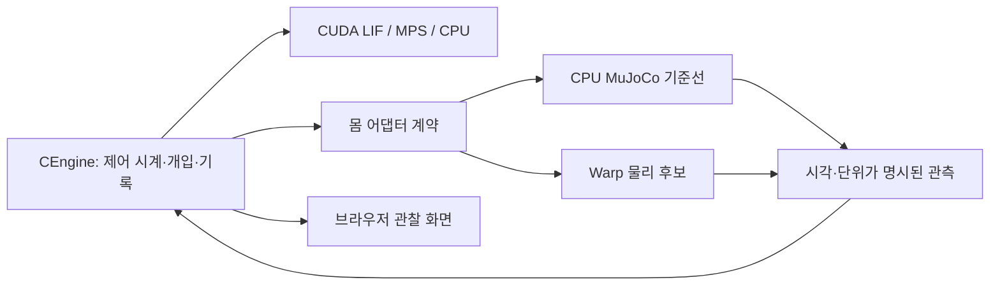

# FlyGym 공식 구현을 반영한 FLY LAB 개선안

작성일: 2026-09-10 · 기준 환경: Windows / RTX 4080 / CUDA 신경 계산 적용 후

**권장 방향은 현재 CUDA 신경 엔진을 유지하면서, FlyGym의 Warp 물리 경로와 감각·근육 도구를 단계적으로 연결하는 것이다.** 먼저 물리 백엔드를 비교할 수 있는 구조와 계측을 만들고, 같은 몸에서 기계적 구동과 신경 구동을 대조한다. 이를 통과한 범위부터 실제 복안·다지점 후각과 보행 실험으로 확장한다.

이 문서는 개선안이다. 이번 작업은 공식 소스 취득·대조와 문서 작성이며, 런타임 코드 수정, 의존성 설치, 서버 조작, 새 시뮬레이션·학습 실행은 하지 않았다. 앞선 CUDA 검증과 과거 Mac의 행동 결과는 저장된 증거로 구분한다.

## 1. 조사 결과와 이번 계획의 기준

| 항목 | 직접 확인한 상태 | 개선안에 미치는 영향 |
|---|---|---|
| 설치 FlyGym | 2.1.0, `ca65a510c2afe6ac61c51df4f274c8d190c2f95f` | 이미 2.x API를 사용한다 |
| 공식 main | `38c8ec61034cd59bc5ba0de20688d4a3c0000d60`, 2026-06-28 UTC | 설치 기준보다 7개 커밋 앞서지만 변경 18개 파일은 문서·뷰어·관련 자산/노트북 |
| Python 구현 비교 | `src/flygym/` 전체 38개와 demo 20개, 총 58개가 설치본과 CRLF/LF 차이를 제외하고 동일 | 버전 교체로 새 물리·제어 구현을 얻는 상황이 아니다. 현재 pin을 유지한다 |
| 프로젝트 기준 | HEAD `abd9a2d74567bc335eddb4ba1af1a81e6e1376a4`와 기존 미커밋 CUDA 변경 | Mac의 옛 소스 기준선과 구분한다 |
| GPU 의존성 | CuPy 14.2.0, PyTorch 2.14.0+cu130 설치. `warp-lang`, `mujoco-warp` 미설치 | CUDA 신경 실행과 Warp 물리 준비는 별도 상태다 |
| 현재 몸 | FlyGym `Simulation` / MuJoCo 3.9.0, 0.1 ms 물리 | GPU 신경 계산과 CPU 몸 계산을 겹쳐 실행 중 |
| 현재 로컬 데이터 | `data/acquisitions/local-windows-20260910`의 FAFB 묶음 | BANC 전체 검증은 해당 데이터·바인딩 재구성이 선행 조건 |

근거: [공식 커밋 비교](https://github.com/NeLy-EPFL/flygym/compare/ca65a510c2afe6ac61c51df4f274c8d190c2f95f...38c8ec61034cd59bc5ba0de20688d4a3c0000d60), [조사 근거 및 파일 해시](C:/Users/ckthd/Dev/Projects/fly_lab/docs/C_FLYGYM_WINDOWS_PLAN_EVIDENCE_20260910.json).

기존 [C0.8 FlyGym 보강안](C:/Users/ckthd/Dev/Projects/fly_lab/docs/C08_FLYGYM_REFINEMENT_20260910.md)은 Mac/MPS 환경을 기준으로 한다. 이 문서는 그 계획의 감각·운동 실패 분리 원칙을 유지하고, NVIDIA 장비가 있는 현재 환경에서는 **Warp 물리 평가를 첫 개발 묶음으로 앞당긴다.** 과거 BANC 실패나 후보 v3의 상태를 이번 조사로 재판정하지 않는다.

공식 README의 CPU 약 10배·GPU 약 300배는 upstream의 별도 워크로드 수치다. 현재 앱에 이미 적용한 CUDA 향상과 곱하거나, 전뇌 단일 세계의 예상 속도로 사용하지 않는다. 앞선 로컬 50 ms × 3회 비교도 짧은 구간의 결과다. [공식 README](https://github.com/NeLy-EPFL/flygym/blob/38c8ec61034cd59bc5ba0de20688d4a3c0000d60/README.md), [로컬 CUDA 검증](C:/Users/ckthd/Dev/Projects/fly_lab/docs/C_CUDA_WINDOWS_20260910.md).

## 2. 유지할 부분과 개선할 부분

| 유지 | 개선 | 채택 전에 확인할 조건 |
|---|---|---|
| 검증된 CUDA LIF, MPS·CPU 기준 계산, dt·입력 지연·개입 의미 | 물리 백엔드를 신경 백엔드와 독립 선택 | 동일 물리 조건에서 실제 step·접촉·복원 비교 |
| `CEngine`의 기록·대조·중단·체크포인트 구조 | CPU `MjData` 직접 접근을 몸 어댑터 안으로 모음 | GPU와 CPU 관측의 원천·시각·단위가 일치 |
| FAFB의 HybridTurningController를 사용하는 비교 경로 | 기계적 제어와 신경 회로 효과의 대조를 강화 | CPG/교사의 성공을 BANC 신경 성공으로 계산하지 않음 |
| 현재 2근육/1관절 Hill 장치와 모멘트암 감시 | 기록 운동학·목표 추적 교사·감각 구동을 같은 장치에서 비교 | 기계적으로 가능한 반응을 감각 회로가 만드는지 확인 |
| 기존 Gaussian 후각과 ray 기반 감각 프로파일 | 공식 복안 관측과 4지점·다성분 후각을 새 프로파일로 추가 | 좌우 대응·샘플 시각·필터·복원·실제 ID 매핑 검증 |
| 실제 접촉 집계·상태 보존·오류 시 중단 | 배치 실행, 지형 확장, 관측용 실제 메시 | 세계 간 독립성과 행동 결과를 별도로 검증 |

## 3. P0 — Warp 물리를 평가할 수 있는 구조

### 3.1 먼저 측정할 비용

현재 [body.py](C:/Users/ckthd/Dev/Projects/fly_lab/flylab/body.py:347)는 5 ms 제어 구간 안에서 0.1 ms마다 반사 계산·행동 적용·물리 step을 수행한다. [engine.py](C:/Users/ckthd/Dev/Projects/fly_lab/flylab/c/engine.py:292)는 CUDA 신경 계산을 제출하고 CPU 물리를 실행한 뒤 기다린다. 현재 `neural_s`는 GPU 실행 시간 전체가 아니라 제출과 남은 대기 시간을 포함한다. 이를 물리 시간과 단순 합산해 병목 비율을 계산하면 안 된다.

`profile_c_runtime.py`를 다음과 같이 보강한다.

- 초기 구성·settling·JIT·warm-up과 정상 실행을 분리한다.
- 전체 폐루프, 기록 명령으로 구동한 몸, 기록 감각으로 구동한 신경을 각각 측정한다. 분리 실행은 원인 분석 자료로 사용한다.
- MuJoCo 내부 timer로 충돌·제약 풀이·적분을 나누고, CUDA event/NVTX로 커널·복사·동기화를 측정한다. 내부 timer와 상세 계측의 추가 비용을 포함한 결과는 절대 처리율로 보고하지 않는다.
- 채택 성능은 계측을 끈 상태에서 측정한다. 단일 세계는 sim/wall과 제어 지연의 중앙값·p95, 배치는 전체 world-step/s와 VRAM 최고값을 보고한다.

공식 구현은 CPU의 `mjcb_time`/`mjData.timer`와 GPU의 Nsight Systems/NVTX 계측을 안내한다. Windows에서 실제 사용할 수 있는 수집 방식을 선택하며, Linux 전용 실행 명령을 그대로 전제하지 않는다. [공식 profiling 안내](https://neuromechfly.org/tutorials/7_performance_profiling/).

### 3.2 JAX 실험과 구분해서 평가

FlyGym `GPUSimulation`은 `warp`와 `mujoco_warp`를 직접 사용한다. 앞선 `probe_mjx_metal.py`의 JAX 의존성 누락은 이 경로의 실행 가능성을 판정한 결과가 아니다. 현재 설치본이 요구하는 범위는 Warp `>=1.14,<1.15`, MuJoCo Warp `>=3.9,<3.10`이다. 평가용 환경에서 이 조합을 고정하고 로드·컴파일·실제 step을 확인한다. [의존성 선언](https://github.com/NeLy-EPFL/flygym/blob/38c8ec61034cd59bc5ba0de20688d4a3c0000d60/pyproject.toml#L39).

Warp 1.14는 Windows x86-64 CUDA wheel을 제공한다. CUDA 13 빌드의 드라이버 하한 580에 비해 앞서 확인한 이 PC의 591.86은 높은 버전이다. 이는 설치 후보의 적합성 근거이며, 현재 앱의 Warp 실행 성공 증거는 아니다. [NVIDIA 설치 문서](https://github.com/NVIDIA/warp/blob/v1.14.0/docs/user_guide/installation.rst).

### 3.3 세 조건으로 물리 옵션과 GPU 효과를 분리

소스 기준으로 공식 기본 모델은 `noslip_iterations=5`이며, `GPUSimulation` 생성자는 이를 지원하지 않아 **넘겨받은 world를 직접 변경해 0으로 설정**한다. 현재 앱은 이 값을 따로 덮어쓰지 않는다. 실행 비교를 시작할 때 컴파일된 모델의 실제 값도 기록한다. 따라서 GPU 전환을 단순한 계산 장치 교체로 취급하지 않는다. [옵션 변경 소스](https://github.com/NeLy-EPFL/flygym/blob/38c8ec61034cd59bc5ba0de20688d4a3c0000d60/src/flygym/warp/simulation.py#L433).

| 조건 | 물리 엔진 | noslip | 비교 목적 |
|---|---|---:|---|
| A | 현재 CPU MuJoCo | 5 | 현재 결과의 기준선 |
| B | CPU MuJoCo | 0 | A↔B로 물리 옵션 변경의 영향 측정 |
| C | MuJoCo Warp | 0 | B↔C로 GPU 구현·정밀도의 영향 측정 |

신경 엔진은 세 조건 모두 현재 CUDA LIF로 고정한다. 동일한 초기 기계 상태·외력·명령을 사용하고, 이후 감각 피드백을 포함한 전체 폐루프를 별도로 비교한다. 후보 world는 복사·재구성하여 현재 실험의 모델을 바꾸지 않는다. 변경된 solver·접촉·precision 옵션 전체를 물리 프로파일의 해시에 포함한다.

### 3.4 `Simulation` 한 줄 교체로 끝내지 않는다

소스상 `GPUSimulation.step()`은 `mjw_data`를 갱신한다. 반면 상속된 접촉 조회와 눈 렌더링은 CPU `mj_data`를 읽는다. 이는 **현재 CPU 앱에서 발견한 오작동이 아니라, GPU 어댑터를 만들 때 해결해야 할 구체적인 통합 위험**이다. 공식 CPU 렌더러도 별도로 `mjw.get_data_into`를 호출해 상태를 옮긴다. [GPU step](https://github.com/NeLy-EPFL/flygym/blob/38c8ec61034cd59bc5ba0de20688d4a3c0000d60/src/flygym/warp/simulation.py#L267), [CPU 상태를 읽는 접촉 API](https://github.com/NeLy-EPFL/flygym/blob/38c8ec61034cd59bc5ba0de20688d4a3c0000d60/src/flygym/simulation.py#L223), [렌더러의 상태 복사](https://github.com/NeLy-EPFL/flygym/blob/38c8ec61034cd59bc5ba0de20688d4a3c0000d60/src/flygym/warp/rendering.py#L349).

제안 구조:

- `--backend`는 현재 신경 계산 의미를 유지한다. 새 `--physics-backend cpu|warp`와 물리 프로파일을 별도로 둔다. 초기 기본값은 검증된 CPU 물리다.
- 몸 어댑터는 step, 관절/접촉/감각 관측, 외력·환경 변경, snapshot/restore를 책임진다. 기존 CPU 경로를 먼저 이 계약에 맞춰 옮기고 결과 보존을 확인한다.
- 최초 Warp 후보는 필요한 시각의 상태를 명시적으로 CPU에 복사해 정확성을 확인한다. 이 단계가 느려도 오류 검출용 기준으로 남긴다.
- 성능 단계에서는 매 0.1 ms CPU 왕복을 피하도록 관절 목표·접착·반사·접촉 집계를 GPU에 유지한다. 기존 반사/CPG 수학과 갱신 주기는 보존한다. 주기를 줄이거나 여러 물리 step을 무조건 묶는 변경은 별도 제어 모델로 평가한다.
- CuPy와 Warp의 장치 버퍼 교환은 소유권·dtype·배열 수명·stream event 의존성을 검증한다. 같은 GPU에서 물리와 신경이 경쟁하므로 각각의 속도를 합쳐 전체 향상을 예측하지 않는다.
- GPU 체크포인트는 동기화 경계, qpos/qvel/act/ctrl, 외력, solver warm-start, 제어기·감각 필터·난수·신경 지연 큐를 포함한다. 같은 GPU 실행환경에서 중단 없는 실행과 복원 후 실행을 비교한다. CPU→Warp 변환은 새 물리 실행으로 기록하며 기존 CPU 체크포인트와의 비트 단위 호환을 약속하지 않는다.

**첫 채택 판단:** 모델 변환 → 한 번의 실제 step → 1세계 기록 명령 재생 → 접촉·관측·복원 → 전체 폐루프 순으로 검사한다. B↔C의 수치 허용오차는 신호별로 작성한 뒤 시험하고, 결과를 본 뒤 넓히지 않는다. A↔B의 행동 변화는 별도 판정이다. 단일 세계의 시간이 10% 이상 감소하고 다른 필수 워크로드의 시간 악화가 5% 이내인 것을 초기 성능 목표로 제안한다. 정합성 실패는 속도로 상쇄하지 않는다. 단일 세계에 이익이 없으면 CPU를 유지하고 배치 용도로만 평가한다.

## 4. P1 — 같은 몸에서 운동학·기계 구동·신경 구동 비교

FlyGym `MotionSnippet`은 6다리×7 DOF 운동학과 fps·관절 이름을 제공하며, 오른쪽 roll/yaw의 좌표 규약을 한 번 변환한다. 먼저 이 자료로 현재 관절 축·좌우 부호·보간·시간축을 검증한다. [공식 운동학 로더](https://github.com/NeLy-EPFL/flygym/blob/38c8ec61034cd59bc5ba0de20688d4a3c0000d60/src/flygym_demo/spotlight_data/preprocessing.py#L11).

근육 쪽은 현재 2 MTU/1 DOF 장치를 출발점으로 한다. 공식 근육 모델은 LF 다리의 15 MTU와 힘줄을 포함하며, 전신 6다리 근육 보행 모델은 아니다. 공식 `ImitationEnv`의 근육 활성도 action과 추적 평가 구조는 참고하되, 목표를 알고 있는 모방학습을 감각 회로 성공으로 분류하지 않는다. [근육 모델 범위](https://neuromechfly.org/tutorials/6_muscle_imitation/), [ImitationEnv](https://github.com/NeLy-EPFL/flygym/blob/38c8ec61034cd59bc5ba0de20688d4a3c0000d60/src/flygym_demo/muscle_imitation/env.py#L84).

| 대조 | 허용되는 정보·출력 | 구분할 실패 |
|---|---|---|
| 기록 운동학 | 목표 q/v와 관절·발 위치 | 좌표·가동 범위·필요한 운동이 맞는가 |
| 기계적 목표 추적 제어 | 같은 몸의 근육 활성도와 목표 궤적 | 현재 힘줄·근육·수동 역학으로 반응을 만들 수 있는가 |
| BANC 감각 폐루프 | 감각 수용기 → 실제 ID → 운동뉴런 → 같은 근육 | 감각이 필요한 운동단위를 모집하는가 |

교사 구동과 BANC 구동의 몸·초기각·외력·평가 구간은 같게 한다. 교사만 성공하면 감각→운동 모집을 우선 조사하고, 양쪽 모두 실패하면 기하·근육·제어기부터 점검한다. 이것만으로 몸이 원리적으로 제어 불가능하다고 단정하지 않는다.

구현 순서는 다음과 같다.

1. 관절명·회전축·단위를 고정하고 ±미소 변위로 발/힘줄 방향을 확인한다. q≈0.61344 rad 모멘트암 반전 감시는 유지한다. 기존 장치의 10 µs 물리 dt를 공식 예제의 100 µs로 되돌리지 않는다.
2. 같은 q/v 기록을 감각 수용기에 재생하고, 감각 입력·presynaptic 전류·운동뉴런 발화·근육 활성·토크를 같은 시간축으로 기록한다.
3. 직접 운동 자극, 정상 감각, 감각 차단, 전달 차단, 수동 역학, 기계 교사 조건을 분리한다. 이득·부호·접착을 동시에 바꾸어 원인을 흐리지 않는다.
4. 2 MTU/1 DOF 통과 후 15 MTU/LF 다리 → 한 다리 접촉 → 양측 → 6다리 순으로 확장한다. 신체 모델을 바꾸는 단계마다 기준선을 새로 만든다.

목표는 정상 감각이 운동 발화와 관절 반응을 바꾸고, 양방향 외력·미사용 자세에서도 감각 차단 대비 IAE(누적 절대 오차)를 20% 이상 줄이는 것이다. 외력 편차는 각 회로의 동일한 무외력 궤적을 빼서 계산하며, 최대 편차도 차단 조건의 1.05배 이하여야 한다. 정상과 절단의 관절 차이는 max(0.0001 rad, 반복/수치 오차의 10배)를 넘고, 전달 또는 운동 차단으로 예상 효과가 사라져야 한다. 이는 [기존 C0.8의 제안 기준](C:/Users/ckthd/Dev/Projects/fly_lab/docs/C08_DEVELOPMENT_PLAN_20260910.md:220)이며 현재 달성 결과가 아니다. 이미 사용한 `0002` clip과 조정용 자세를 최종 확인 자료로 재사용하지 않는다. [기존 단일 관절 결과](C:/Users/ckthd/Dev/Projects/fly_lab/docs/C07_SINGLE_JOINT_RESULTS_20260910.md).

대상 파일: [single_joint.py](C:/Users/ckthd/Dev/Projects/fly_lab/flylab/c/single_joint.py), [muscle_calibration.py](C:/Users/ckthd/Dev/Projects/fly_lab/flylab/c/muscle_calibration.py), [receptors.py](C:/Users/ckthd/Dev/Projects/fly_lab/flylab/c/receptors.py), [probe_c_joint_feedback.py](C:/Users/ckthd/Dev/Projects/fly_lab/tools/probe_c_joint_feedback.py). BANC 전체 검사는 데이터 묶음의 해시·주석·바인딩을 확보한 다음 실행한다.

## 5. P1 — 접촉·접착을 분리하고 보행 원인을 좁히기

공식 접촉 API는 contact frame의 wrench와 world frame의 합력을 구분한다. 현재 최적화한 접촉 집계는 같은 상태에서 공식 CPU API와 교차 검사하는 기준으로 유지한다. 바닥 지지, 벽·장애물 충돌, 접착으로 생긴 힘을 norm 하나에 섞지 않는다. [공식 접촉 구현](https://github.com/NeLy-EPFL/flygym/blob/38c8ec61034cd59bc5ba0de20688d4a3c0000d60/src/flygym/simulation.py#L266).

현재 BANC v3의 운동단위 합산과 발 들림에 따른 접착 해제는 소스에 있지만 `EXPERIMENTAL_NOT_VALIDATED`다. 기존 네 조건 비교 도구로 **기존/새 합산 × 기존/새 접착**을 검사한다. 실제 발 높이·미끄럼·접촉 지속시간·접착 명령·몸 이동·신경 발화를 저장하고 Jacobian의 예측 들림을 실제 발 들림으로 표현하지 않는다. [현재 후보](C:/Users/ckthd/Dev/Projects/fly_lab/flylab/c/neuromuscular.py:130), [비교 도구](C:/Users/ckthd/Dev/Projects/fly_lab/tools/compare_c_banc_gait.py).

평면에서 기존 10초·순이동 5 mm·전방 이동 5 mm·고착 없음 기준을 통과한 뒤 틈·블록·혼합 지형을 추가한다. FlyGym의 다중 geom 지형은 기존 다리별 ground contact sensor를 자동 제공하지 않으므로 접촉 목록을 이용한 수용기 입력을 명시적으로 구성한다. 경사면에서는 현재 +z 기준을 접촉면 법선으로 바꾼 새 프로파일을 검증한다. [지형의 센서 제한](https://github.com/NeLy-EPFL/flygym/blob/38c8ec61034cd59bc5ba0de20688d4a3c0000d60/src/flygym/compose/world/complex_terrain.py#L16).

## 6. P2 — 복안과 다지점 후각을 실제 입력 경로에 연결

### 복안

현재 입력은 ray panorama와 실루엣 변화이며 FlyGym Retina를 읽지 않는다. 공식 `add_vision` → `get_raw_vision` → `get_ommatidia_readouts`를 이용해 눈별 영상과 ommatidia의 색 유형별 채널을 우선 관측한다. 현재 모든 몸 geom을 group 2로 설정하는 정책은 눈 렌더러의 자기 가림 정책과 충돌하므로, ray 제외와 눈의 가림을 분리한다. [시각 구현](https://github.com/NeLy-EPFL/flygym/blob/38c8ec61034cd59bc5ba0de20688d4a3c0000d60/src/flygym/simulation.py#L408), [현재 geom 설정](C:/Users/ckthd/Dev/Projects/fly_lab/flylab/body.py:117).

첫 단계는 관측 전용이다. 호출 유무에 따른 신경·몸 상태 차이가 없어야 한다. 이후 별도 감각 프로파일에서 물리 tick에 맞춘 100 Hz 또는 200 Hz 중 한 주기를 고정하고 영상 시각·이전 영상·필터·다음 샘플 tick을 저장한다. CUDA 그래프가 중간에 예전 영상을 사용했다면 해당 영상 시각을 기록한다. ommatidium을 뉴런 ID와 임의로 일대일 연결하지 않고, 검토된 retinotopy·실제 ID 범위부터 매핑한다.

확인은 좌우 교환, 몸 회전, 정지/이동 표적, 가림, looming 속도를 교차한다. GPU 물리에서는 렌더 대상 상태의 동기화부터 검증하며, 일반 GPU batch renderer가 곧바로 Retina 감각 처리를 제공한다고 가정하지 않는다.

### 후각

현재는 두 상대 위치의 Gaussian 냄새장과 선택적 농도 압축을 사용한다. 조사한 FlyGym 2.x core Python에는 전용 후각 API가 확인되지 않았다. 공식 구형 `flygym-gymnasium`의 `OdorArena`에서 **두 antenna·두 maxillary palp, 다성분 농도장**이라는 계약을 가져와 현재 2.x 환경에 별도 구현한다. 옛 엔진을 통째로 혼합하지 않는다. [공식 구형 후각 구현](https://github.com/NeLy-EPFL/flygym-gymnasium/blob/d285260a1c8a7b3494150cd1590f2c9fe4b5e06b/flygym_gymnasium/arena/sensory_environment.py#L68).

수용 위치는 검증된 body/site에서 읽고, 농도장 → 수용기 반응 → ORN 입력을 분리한다. Gaussian, 역제곱, 시간변화 plume은 서로 다른 환경 모델로 등록한다. 원농도와 변환값을 함께 기록하고 냄새 세기·음식 재고·영양량을 분리한다. 좌우 포화·좌우 위치 교환·감각 차단·냄새장 이동을 검사한 뒤 같은 행동 과제로 평가한다.

대상 파일: [body.py](C:/Users/ckthd/Dev/Projects/fly_lab/flylab/body.py), [C 센서](C:/Users/ckthd/Dev/Projects/fly_lab/flylab/c/sensors.py), [ports.py](C:/Users/ckthd/Dev/Projects/fly_lab/flylab/c/ports.py), [metabolism.py](C:/Users/ckthd/Dev/Projects/fly_lab/flylab/c/metabolism.py). 관측 카메라의 영상은 사용자 표시용이며 신경 입력용 눈 영상과 별도로 취급한다.

## 7. P2 — 배치 실험과 사용자 관찰 화면

Warp 배치는 동일한 몸·지형 모델을 공유하는 세계부터 구성한다. 시드·입력·동적 상태는 다를 수 있지만, 서로 다른 형상·접촉 구성을 같은 배치에 섞지 않는다. 모델 해시별로 작업을 묶고 배치 크기 1 → 8 → 16 → 32를 후보로 측정한다. [공식 GPU 배치 예제](https://neuromechfly.org/tutorials/3_gpu_accelerated_simulation/).

FAFB 기본 상태의 전압·전류·발화율·64비트 계수·19슬롯 지연 큐만으로 약 **13.81 MiB/세계**가 필요하다. 현재 CSR 관련 장치 배열은 약 **43.78 MiB/엔진**이며, 현재 구현은 엔진마다 이를 만든다. 이는 소스 기반 하한 계산으로, 실제 VRAM 측정이나 32세계 실행 가능성 보장이 아니다. 물리 제약 버퍼·렌더러·CUDA Graph·기록·allocator·표시용 메모리가 추가된다.

배치 신경 엔진을 만들 때는 topology 공유와 세계별 상태를 구분한다. 현재 개입은 가중치와 마스크를 바꾸므로, 가중치까지 무조건 공유하면 세계 간 간섭이 생길 수 있다. ResearchLIF의 가소성 가중치, 각 세계의 RNG·개입·감각 이력은 독립 소유한다. 메모리 부족 시 기록이나 뉴런을 생략하지 않고 배치 크기를 줄인다.

화면은 선택한 한 세계의 실제 메시·접촉·감각을 표시한다. 같은 모델에서 시각 자산을 생성하는 공식 viewer 구성을 참고하고, 포즈 좌표와 모델 해시를 함께 검증한다. 현재 서버의 물리 상태를 표시하는 구조를 유지한다. 공식 WASM viewer는 별도 물리 시뮬레이터이며, 자세 조작용으로 noslip을 300, solver 반복을 200, 마찰을 5로 높인다. 이 설정을 현재 행동 모델에 그대로 가져오지 않는다. 화면 FPS, 신경·물리 sim/wall, 원자료 기록 빈도를 따로 표시한다. 메시가 자세해진 것을 물리나 신경 정확도 개선으로 보고하지 않는다. [공식 viewer 자산 생성](https://github.com/NeLy-EPFL/flygym/blob/38c8ec61034cd59bc5ba0de20688d4a3c0000d60/scripts/dev/build_wasm_viewer_assets.py#L56).

## 8. 권장 개발 묶음과 완료 기준

아래 파일명은 후속 구현 산출물의 제안이다. 이번 작업에서 해당 구현이나 테스트를 만들었다는 뜻은 아니다.

| 순서 | 개발 묶음 | 산출물 | 완료 판단 |
|---|---|---|---|
| 1 | 현재 성능 분해·CPU 몸 계약 | 보강한 profiler, 몸 API 목록, 기준선 보고서 | 상태 보존, warm-up/계측 비용 분리, 병목과 기준값 확인 |
| 2 | Warp 1세계 어댑터·A/B/C 비교 | `body_warp.py`, `verify_c_warp.py`, 물리 프로파일 | 명령·접촉·감각·외력·환경 변경·복원 검증. 단일 세계 채택 여부 결정 |
| 3 | 운동학·기계 교사·신경 대조 | 교사/replay 모드, 단일 관절 원인 보고서 | 같은 장치에서 감각의 운동 효과와 양방향 외력 개선 확인 |
| 4 | 접착·운동단위 비교와 한 다리 확장 | 네 조건 결과, 접촉·근육 추적 기록 | 합산/접착 각각의 효과, 지지·미끄럼·신경 차단 대조 확인 |
| 5 | 복안·후각 관측 후 실제 ID 연결 | 버전 있는 감각 프로파일과 체크포인트 | 좌우·시계·가림·포화·복원 및 감각 차단 효과 확인 |
| 6 | 배치 캠페인·실제 메시 관찰 | 모델별 배치 스케줄러, 선택 세계 표시 | 세계 간 간섭 0, 취소/재개·기록 누락 0, 처리량·VRAM 실측 |

성능은 같은 신경·물리 설정, 고정된 5개 시드, 3회 반복, 별도 warm-up으로 비교하는 것을 제안한다. 직접 자극, 정지, 접촉 많은 장면, 512채널 기록, UI 연결을 포함한다. 전체 시스템이 60모델초 동안 sim/wall ≥ 1을 유지해야 실시간 달성으로 표시한다. 이 기준은 실행 결과가 아니라 후속 평가 목표다.

GPU 동일 백엔드의 반복/복원 검사는 가능한 정밀도에서 먼저 엄격하게 수행하고, 비결정성이 관측되면 그 발생 조건과 허용 범위를 명시한다. CPU↔GPU 물리는 정밀도·접촉 민감도를 고려해 궤적, 힘, 발 미끄럼, 전도, 과제 결과를 함께 평가한다. 장치 변환 성공이나 유한한 숫자만으로 통과시키지 않는다. 신경 계산만 비교하는 검사와 감각까지 달라지는 전체 폐루프 비교를 구분한다.

**바로 착수할 범위는 1–2번이다.** 그 결과로 현재 CPU 물리와 Warp 물리의 채택 범위를 결정할 수 있다. 3–5번은 감각–운동 기능의 실제 개선 경로이며, Warp 성능이 기대에 못 미쳐도 CPU 몸 기준선에서 계속 진행할 수 있다. 대규모 PPO, 6다리 근육 일괄 전환, 자유 비행·이착륙은 앞 단계의 교정과 제어 검증 뒤에 둔다.
